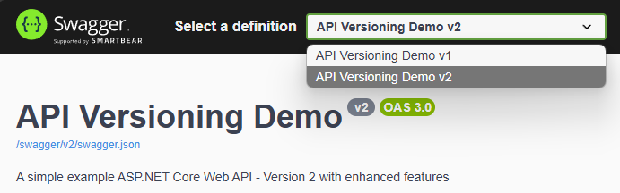

An **ASP.NET Core** minimal API demonstration showcasing **API versioning**, and **Swagger integration**.

## 📁 Project Structure

```
api_versioning/
├── Program.cs                # Main application and API endpoints
├── api_versioning.http       # Comprehensive test suite
├── api_versioning.csproj     # Project dependencies
├── README.md                 # This file
```

### 💡 Works with this configuration ('cause the dropdown didn't work in later versions of Swashbuckle)
```xml
<ItemGroup>
    <PackageReference Include="Asp.Versioning.Http" Version="8.1.0" />
    <PackageReference Include="Asp.Versioning.Mvc.ApiExplorer" Version="8.1.0" />
    <PackageReference Include="Microsoft.AspNetCore.OpenApi" Version="9.0.5" />
    <PackageReference Include="Swashbuckle.AspNetCore.Swagger" Version="6.5.0" />
    <PackageReference Include="Swashbuckle.AspNetCore.SwaggerGen" Version="6.5.0" />
    <PackageReference Include="Swashbuckle.AspNetCore.SwaggerUI" Version="6.5.0" />
</ItemGroup>
```


## ⚖️ License

This project is licensed under the MIT License - see the [LICENSE](LICENSE) file for details.

## 📚 Libraries

- [Swashbuckle.AspNetCore](https://github.com/domaindrivendev/Swashbuckle.AspNetCore) - Swagger/OpenAPI documentation for ASP.NET Core
- [Asp.Versioning](https://github.com/dotnet/aspnet-api-versioning) - API versioning for ASP.NET Core


---

Built with ❤️ using ASP.NET Core Minimal APIs